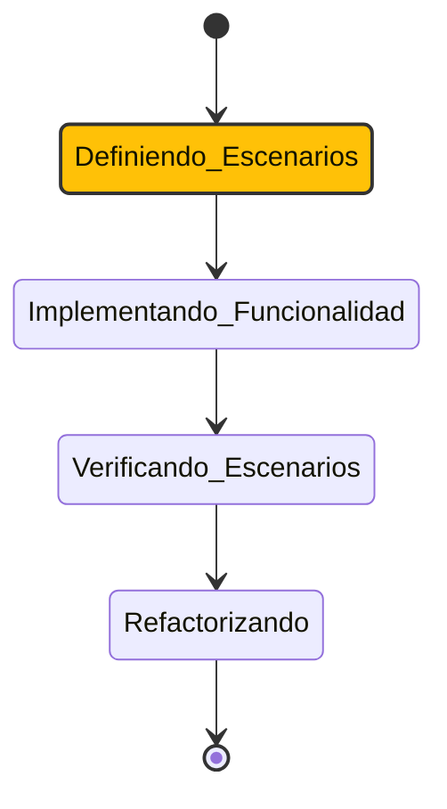

# Active Context: Hodei Packages

## 1. Enfoque Actual

El trabajo actual consiste en **implementar la API REST para la gestión de artefactos Maven, npm y PyPI**, basándose en la especificación OpenAPI proporcionada. La implementación se realizará en el módulo `infrastructure` utilizando Ktor, siguiendo la Arquitectura Hexagonal.

## 2. Estado BDD Actual: Definiendo Escenarios

Nos encontramos en la fase de **Definiendo Escenarios**. Antes de escribir el código de la implementación, debemos traducir los requisitos de la API en escenarios BDD concretos que guiarán el desarrollo. Los primeros escenarios se centrarán en la subida y descarga de artefactos Maven.

## 3. Próximos Pasos

1.  **Crear archivos de rutas Ktor**: Crear o modificar los archivos en `infrastructure/ktor/routes` para cada tipo de paquete (Maven, npm, PyPI).
2.  **Definir el primer escenario BDD**: Escribir una prueba de Kotest para el caso de uso "Subir un artefacto Maven con éxito".
3.  **Implementar la ruta `PUT /maven/{...}`**: Escribir el código en el adaptador de Ktor para que la prueba pase.
4.  **Conectar con el servicio de aplicación**: La ruta de Ktor invocará al `ArtifactPublicationService` correspondiente.

## 4. Ubicación del Trabajo

El trabajo se centrará principalmente en el directorio `backend/infrastructure/src/main/kotlin/dev/rubentxu/hodei/packages/infrastructure/ktor/routes/`.