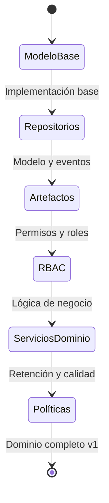

# Enfoque y Estado Actual del Desarrollo (activeContext.md)

## Enfoque del Trabajo Actual

Implementar la capa de dominio del sistema de repositorio de artefactos Hodei Packages siguiendo rigurosamente los principios de la Arquitectura Hexagonal y TDD. El objetivo es construir un núcleo de negocio robusto, bien probado y desacoplado que se enfoque en la gestión de repositorios y artefactos según lo definido en el PRD.

El trabajo se centrará en:

1. **Desarrollo del Modelo de Dominio:** Implementar y expandir los modelos de dominio en `backend/domain/src/main/kotlin/dev/rubentxu/hodei/packages/domain/model/`, comenzando con los modelos para repositorios, artefactos, permisos y roles.
   
2. **Definición de Puertos:** Crear interfaces claras en `backend/domain/src/main/kotlin/dev/rubentxu/hodei/packages/domain/repository/` para la interacción con la infraestructura, garantizando la inversión de dependencias.

3. **Definición de Eventos de Dominio:** Expandir el sistema de eventos en `backend/domain/src/main/kotlin/dev/rubentxu/hodei/packages/domain/events/` para soportar operaciones sobre repositorios y artefactos, siguiendo el enfoque de arquitectura dirigida por eventos.

4. **Servicios de Dominio:** Implementar servicios que contengan la lógica de negocio compleja y orquesten las operaciones entre diferentes entidades del dominio.

5. **Pruebas Unitarias:** Crear pruebas exhaustivas para validar el comportamiento de los modelos, servicios y puertos del dominio.

## Estado TDD Actual

* **Fase Actual:** Estamos implementando los componentes clave del dominio siguiendo el ciclo TDD (Rojo → Verde → Refactor).

* **Progreso Actual:**
  - ✅ Implementado `Repository` y `RepositoryType` con validaciones
  - ✅ Implementado `Artifact` con validaciones de versión semántica
  - ✅ Definidos puertos `RepositoryRepository` y `ArtifactRepository`
  - ✅ Creados eventos de dominio para repositorios y artefactos
  - 🔄 En progreso: Implementación del modelo RBAC (permisos y roles)

* **Próximos Pasos**:
  - Implementar el modelo de permisos y roles para repositorios (RBAC)
  - Crear servicios de dominio para operaciones complejas
  - Implementar políticas de retención y gestión de versiones
  - Definir modelo para estadísticas y auditoría

## Decisiones y Consideraciones Activas

* **Inmutabilidad:** Todos los modelos de dominio se implementan como `data class` inmutables para garantizar la integridad del dominio.

* **Validaciones:** Las reglas de negocio están encapsuladas en el dominio a través de validaciones en los constructores de las entidades.

* **Semántica de Versiones:** Implementación de validación de versionado semántico para artefactos según el estándar SemVer.

* **Eventos vs. Comandos:** Se ha optado por un modelo de eventos de dominio para comunicar cambios de estado, permitiendo desacoplar componentes y facilitar la escalabilidad.

* **Granularidad de Permisos:** Se está diseñando un sistema RBAC flexible que permita permisos a nivel de repositorio con roles predefinidos y personalizados.

* **Almacenamiento:** Aunque el dominio es agnóstico a la implementación, se está diseñando considerando tanto almacenamiento en sistema de archivos (rendimiento) como bases de datos (metadatos).

## Patrones y Preferencias Importantes

* **Ciclo TDD estricto:** Rojo → Verde → Refactor para cada componente.
* **Arquitectura Hexagonal:** Separación clara entre dominio, aplicación e infraestructura.
* **Diseño Dirigido por el Dominio (DDD):** Modelado explícito de conceptos del dominio.
* **Lenguaje Ubicuo:** Nombramiento expresivo que refleje el lenguaje del negocio.
* **Desarrollo Dirigido por Eventos:** Uso de eventos para comunicar cambios de estado.
* **Inversión de Dependencias:** El dominio define puertos que la infraestructura implementa.