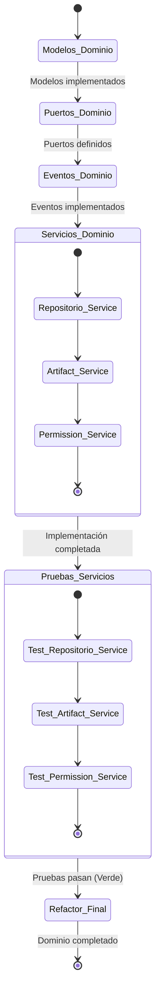

# Enfoque y Estado Actual del Desarrollo (activeContext.md)

## Enfoque del Trabajo Actual

Implementar la capa de dominio del sistema de repositorio de artefactos Hodei Packages siguiendo rigurosamente los principios de la Arquitectura Hexagonal y TDD. El objetivo es construir un núcleo de negocio robusto, bien probado y desacoplado que se enfoque en la gestión de repositorios y artefactos según lo definido en el PRD.

El trabajo se centrará en:

1. **Desarrollo del Modelo de Dominio:** Implementar y expandir los modelos de dominio en `backend/domain/src/main/kotlin/dev/rubentxu/hodei/packages/domain/model/`, comenzando con los modelos para repositorios y artefactos.
   
2. **Definición de Puertos:** Crear interfaces claras en `backend/domain/src/main/kotlin/dev/rubentxu/hodei/packages/domain/repository/` para la interacción con la infraestructura.

3. **Definición de Eventos de Dominio:** Expandir el sistema de eventos en `backend/domain/src/main/kotlin/dev/rubentxu/hodei/packages/domain/events/` para soportar operaciones sobre repositorios y artefactos.

4. **Implementación de Servicios de Dominio:** Desarrollar servicios que encapsulen la lógica de negocio compleja en `backend/domain/src/main/kotlin/dev/rubentxu/hodei/packages/domain/service/`.

5. **Pruebas Unitarias:** Crear pruebas exhaustivas para validar el comportamiento de los modelos, servicios y ports del dominio.

## Estado TDD Actual

* **Fase Verde-Refactor:** Hemos completado la implementación de modelos de dominio, puertos y eventos. Ahora estamos en la fase de implementación y prueba de los servicios de dominio que orquestan la lógica de negocio más compleja.

* **Prueba(s) en Enfoque (Actual/Próximas)**:
  1. **Servicios de Dominio:** Creando y probando servicios que encapsulan la lógica de negocio para repositorios, artefactos y permisos.
  2. **Integración de Componentes:** Asegurando que los diferentes componentes del dominio (modelos, servicios, eventos) funcionen correctamente juntos.
  3. **Casos de Uso Complejos:** Validando escenarios de negocio que involucran múltiples componentes.

## Cambios Recientes

* Implementación de los modelos de dominio `Repository`, `Artifact`, `Role` y `UserPermission` con sus respectivas validaciones.
* Definición de los puertos (interfaces) `RepositoryRepository`, `ArtifactRepository` y `PermissionRepository`.
* Implementación de eventos de dominio para operaciones sobre repositorios, artefactos y permisos.
* Desarrollo de los servicios de dominio `RepositoryService`, `ArtifactService` y `PermissionService`.
* Creación de pruebas unitarias para los modelos y servicios de dominio.

## Próximos Pasos Inmediatos

1. **Completar Pruebas de Servicios**:
   * Implementar pruebas para `ArtifactService` y `PermissionService`.
   * Validar casos de uso complejos que involucran varios servicios.
   
2. **Refinar la Gestión de Eventos**:
   * Asegurar que los eventos de dominio contengan toda la información necesaria.
   * Validar que se emitan correctamente en cada caso de uso.
   
3. **Documentación del Dominio**:
   * Actualizar la documentación con las decisiones de diseño tomadas.
   * Generar diagramas que muestren las relaciones entre componentes.
   
4. **Preparación para la Capa de Aplicación**:
   * Definir los casos de uso que utilizarán los servicios de dominio.
   * Planificar la integración con adaptadores de infraestructura.

## Decisiones y Consideraciones Activas

* **Inmutabilidad de Modelos:** Todos los modelos de dominio se han implementado como `data class` inmutables para garantizar la integridad del dominio.
* **Validaciones de Dominio:** Las reglas de negocio están encapsuladas en el dominio, generando excepciones específicas cuando no se cumplen.
* **Diseño Dirigido por Eventos:** Los eventos de dominio comunican cambios importantes, facilitando un diseño desacoplado y extensible.
* **Servicios con Responsabilidad Única:** Cada servicio de dominio se enfoca en un aspecto específico del negocio (repositorios, artefactos, permisos).
* **Inyección de Dependencias:** Los servicios reciben sus dependencias (puertos, publicador de eventos) a través del constructor.
* **Control de Acceso Basado en Roles:** El sistema RBAC implementado permite una gestión flexible y granular de permisos.

## Patrones y Preferencias Importantes

* Ciclo TDD: Rojo -> Verde -> Refactor.
* Arquitectura hexagonal: separación clara entre dominio y adaptadores.
* Uso de eventos de dominio para comunicar cambios de estado.
* Modelado explícito de conceptos del dominio (DDD táctico).
* Nombramiento expresivo que refleje el lenguaje del dominio.
* Servicios de dominio que orquestan operaciones complejas.

Tags: active_context, tdd_state, domain_implementation, repository_system, hexagonal_architecture, event_driven, domain_services