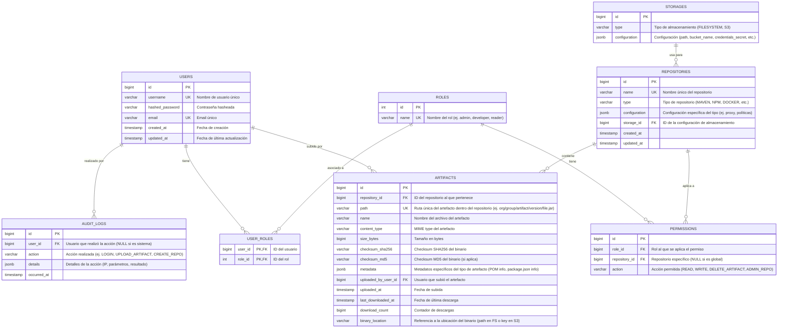

# Data Model: Modelo de Datos para PostgreSQL

Este documento describe el modelo de datos inicial para los metadatos que se almacenarán en PostgreSQL. Los artefactos binarios se almacenarán en el sistema de ficheros o S3.

## 1. Diagrama Entidad-Relación (ERD) - Conceptual

## 2. Descripción de las Tablas Principales

*   **USERS:** Almacena la información de los usuarios del sistema.
*   **ROLES:** Define los roles disponibles en el sistema (ej. `admin`, `developer`, `reader`).
*   **USER_ROLES:** Tabla de unión para la relación muchos-a-muchos entre usuarios y roles.
*   **REPOSITORIES:** Define los repositorios de artefactos. Cada repositorio tiene un tipo (Maven, npm, etc.) y una configuración específica.
*   **STORAGES:** Define las configuraciones de almacenamiento para los binarios de los artefactos (ej. un path en el sistema de archivos local, o un bucket S3 con sus credenciales).
*   **ARTIFACTS:** Contiene los metadatos de cada artefacto almacenado, incluyendo su ruta, tamaño, checksums, quién lo subió y dónde está el binario.
*   **PERMISSIONS:** Define qué acciones puede realizar un rol sobre un repositorio específico (o globalmente si `repository_id` es NULL).
*   **AUDIT_LOGS:** Registra eventos importantes del sistema para auditoría.

## 3. Consideraciones

*   **Indexación:** Se crearán índices adecuados en columnas usadas frecuentemente en búsquedas (FKs, `username`, `email`, `repository.name`, `artifact.path`, etc.) para optimizar el rendimiento.
*   **Checksums:** Esenciales para verificar la integridad de los artefactos.
*   **Metadatos Específicos (`ARTIFACTS.metadata`):** El campo JSONB permitirá flexibilidad para almacenar metadatos diferentes según el tipo de artefacto (ej. dependencias de un POM, información de `package.json`).
*   **Configuración Flexible (`REPOSITORIES.configuration`, `STORAGES.configuration`):** Campos JSONB para configuraciones extensibles.
*   **Relaciones:** Las claves foráneas (FK) aseguran la integridad referencial.

Este modelo es inicial y evolucionará a medida que se desarrollen los casos de uso. Se utilizarán migraciones de base de datos (ej. Flyway, Liquibase) para gestionar los cambios de esquema.
